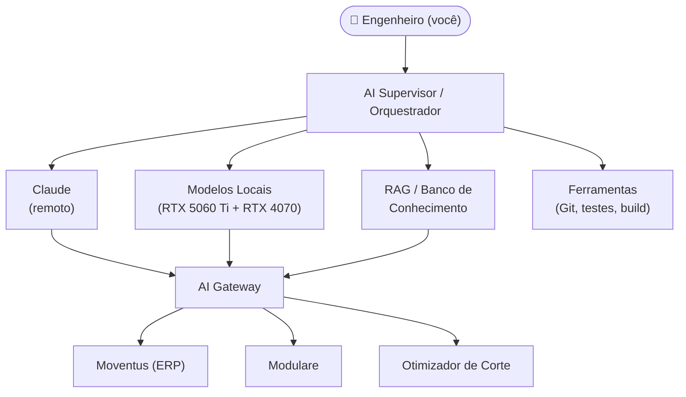
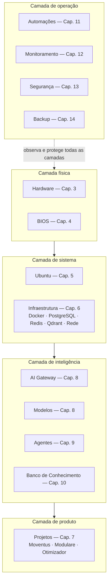
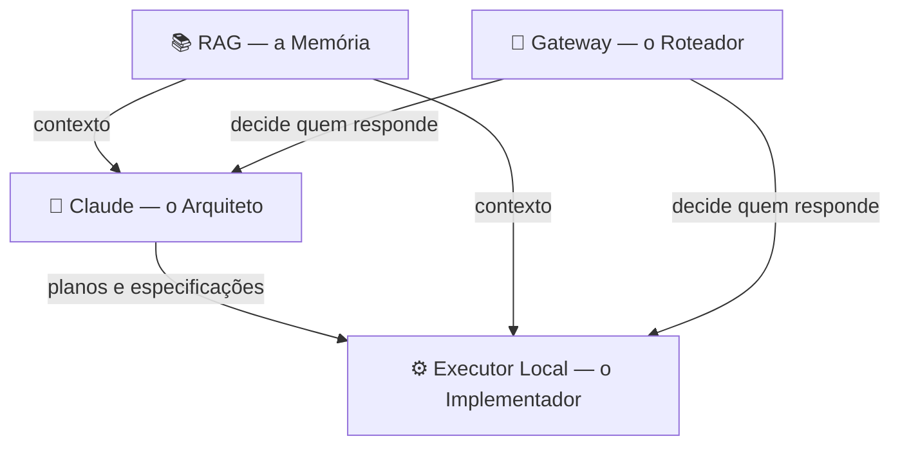
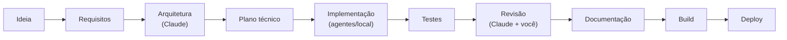
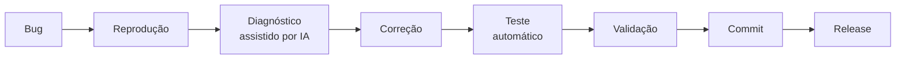
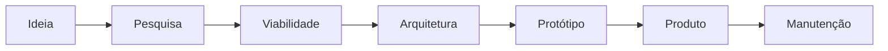

# 2. Arquitetura

Este capítulo apresenta o desenho geral da plataforma: as camadas, os papéis de cada componente de IA e os fluxos de trabalho padronizados.

!!! warning "Leia com o status em mente"
    A máquina está em montagem. Neste capítulo, a arquitetura descrita é o **alvo** — cada componente carrega seu badge de status. Conforme os componentes entrarem em operação, os badges mudam para Existe e este aviso será removido.

## 2.1 Visão geral

| Componente | Função | Status |
|---|---|---|
| Engenheiro | Decide, revisa, aprova. Único ponto com autoridade final. | Existe |
| AI Supervisor | Orquestra quais IAs e ferramentas participam de cada tarefa | Proposto |
| Claude | Arquitetura, planejamento, revisão, decisões | Existe |
| Modelos locais | Implementação, refatoração, testes, tarefas de volume | Existe — Onda 1 no ar desde 21/07/2026 ([Cap. 8](08-inteligencia-artificial.md)) |
| RAG | Memória permanente: documentação, histórico, contexto | Proposto |
| AI Gateway | Interface única de IA para os projetos | Proposto |
| Projetos (Moventus, Modulare, Corte) | Os produtos que justificam a plataforma | Existe |

!!! note "Sobre o nome 'Hermes'"
    Em conversas anteriores o orquestrador foi chamado de *Hermes*. O nome é A confirmar — o componente em si está registrado aqui como **AI Supervisor**, e o batismo oficial acontecerá quando ele sair do papel. A arquitetura não depende do nome (Princípio P2 — Modularidade).

## 2.2 Arquitetura em camadas

A plataforma é organizada em camadas, cada uma documentada em seu próprio capítulo. Uma camada só depende da camada imediatamente abaixo — nunca o contrário.

O sentido da dependência é a regra mais importante do desenho: **os projetos não sabem qual modelo de IA os atende** (falam com o gateway), **o gateway não sabe em qual GPU roda** (fala com o sistema), e assim por diante. Trocar uma peça de qualquer camada não deve exigir mudanças acima dela.

## 2.3 Papéis da IA

A divisão de trabalho entre as IAs segue uma lógica simples: **raciocínio caro e decisões vão para o melhor modelo disponível; volume e repetição vão para os modelos locais**, que custam apenas energia elétrica.

### Claude — o Arquiteto Existe

**Responsabilidades:** arquitetura, planejamento, design de soluções, revisão de código, decisões técnicas, escrita de ADRs.

**Por que o Claude é o arquiteto e não o executor?** Porque o valor de um modelo de ponta está no raciocínio, não na digitação. Usar o melhor modelo disponível para gerar milhares de linhas de código repetitivo é caro e desnecessário; usá-lo para decidir *o que* construir e revisar *o que foi* construído concentra o custo onde há mais retorno. Além disso, planos e revisões são artefatos pequenos e auditáveis — fáceis de validar antes de virarem código.

### Executor Local — o Implementador Planejado

**Responsabilidades:** implementação a partir de especificações, refatoração, geração de testes, tarefas de volume (boilerplate, migrações, conversões).

**Por que separar modelos locais e remotos?** Três motivos: **custo** (o local roda 24 h por dia pelo preço da energia), **privacidade** (código sensível dos produtos não precisa sair da máquina) e **disponibilidade** (a estação funciona mesmo sem internet ou com o fornecedor fora do ar — Princípio P3).

### RAG — a Memória Proposto

**Responsabilidades:** dar contexto permanente a todas as IAs — documentação dos projetos, histórico de decisões, este manual, esquemas de banco, código existente.

**Por que usamos RAG em vez de "colar tudo no prompt"?** Porque o conhecimento da Protustech cresce sem parar e nenhuma janela de contexto o comporta inteiro. O RAG busca apenas o relevante para cada tarefa, mantém uma única fonte de verdade (em vez de cópias desatualizadas em prompts) e funciona igual para qualquer modelo — remoto ou local.

### Gateway — o Roteador Proposto

**Responsabilidades:** expor uma interface única de IA para todos os projetos; decidir, por tarefa, se quem responde é o Claude, um modelo local ou uma combinação; aplicar cache, logging e limites de custo.

**Por que ter um AI Gateway?** Porque sem ele cada projeto integraria diretamente com um fornecedor específico — e trocar de modelo exigiria mexer em todos os projetos. Com o gateway, a troca acontece em um único lugar (Princípios P2 e P3). Ele também é o ponto natural para medir custo e desempenho de cada modelo.

## 2.4 Fluxos de trabalho padronizados

Os três fluxos abaixo são os "trilhos" sobre os quais todo o trabalho corre. Eles serão detalhados, com ferramentas e comandos, no [Capítulo 7](07-desenvolvimento.md).

### Fluxo de nova funcionalidade

### Fluxo de correção de bug

### Fluxo de novo produto

A regra comum aos três fluxos: **nenhuma etapa é pulada, mas toda etapa pode ser acelerada por IA.** A reprodução de um bug pode ser automatizada, o diagnóstico pode ser assistido, a correção pode ser gerada — mas o fluxo `Bug → Release` sempre passa por teste e validação.

## 2.5 Decisões de arquitetura deste capítulo

As decisões que sustentam este desenho estão registradas como ADRs no [Apêndice](16-apendices/adrs.md):

| ADR | Decisão | Status |
|---|---|---|
| [ADR-001](16-apendices/adrs.md#adr-001) | Ubuntu LTS como sistema operacional | Aceito |
| [ADR-002](16-apendices/adrs.md#adr-002) | MkDocs Material para o manual | Aceito |
| [ADR-003](16-apendices/adrs.md#adr-003) | Claude como arquiteto, modelos locais como executores | Aceito |
| [ADR-004](16-apendices/adrs.md#adr-004) | AI Gateway como camada de desacoplamento | Proposto |
| [ADR-005](16-apendices/adrs.md#adr-005) | PostgreSQL como banco relacional padrão | Proposto |
