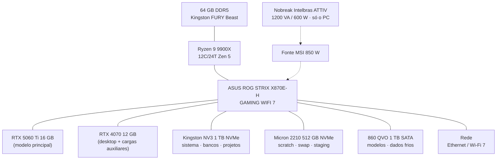

# 3. Hardware

Este capítulo é o inventário oficial da estação. Toda compra, troca ou expansão de hardware **deve** ser registrada aqui no mesmo dia (Regra de ouro do manual).

## 3.1 Inventário atual

**Status geral:** hardware adquirido, montagem em andamento Em montagem

| Componente | Modelo | Especificação | Status |
|---|---|---|---|
| CPU | AMD Ryzen 9 9900X | Zen 5 · 12 núcleos / 24 threads · AM5 | Existe |
| Placa-mãe | ASUS ROG STRIX X870E-H GAMING WIFI 7 | AM5 · chipset X870E | Existe |
| RAM | Kingston FURY Beast RGB DDR5 | 64 GB · DDR5-6000 (configuração dos módulos: a confirmar) | Existe |
| GPU 1 | RTX 5060 Ti 16 GB | Blackwell · limite 180 W · dedicada a computação (sem vídeo) | Existe |
| GPU 2 | RTX 4070 12 GB | Ada · limite 200 W · saída de vídeo/desktop | Existe |
| SSD 1 | Kingston NV3 (SNV3S1000G) | 1 TB (1000,2 GB) · NVMe PCIe 4.0 · DRAM-less (HMB) | Existe |
| SSD 2 | Micron 2210 (MTFDHBA512QFD) — rótulo `NVME512` | 512 GB · NVMe PCIe 3.0 · QLC · Windows antigo apagado, ext4 desde 21/07/2026 | Existe |
| SSD 3 | Samsung **860 QVO** 1 TB — rótulo `SSD1TB` | SATA · QLC · ext4 · identificado pelo sistema em 21/07/2026 (o inventário inicial o registrava como "870 QVO" — corrigido) | Existe |
| SSD 4 | Kingston **A400** 960 GB (SA400S37960G) — rótulo `SSD960` | SATA · ext4 · instalado em 21/07/2026 | Existe |
| Fonte (PSU) | MSI 850 W | Linha/modelo exato e certificação: a confirmar | Existe |
| Gabinete e refrigeração | — | a confirmar | A confirmar |
| Nobreak | Intelbras ATTIV 1200 VA 220V | **1200 VA / 600 W** · entrada e saída 220 V · 60 Hz · nº de série BHF009319290 · **alimenta somente o PC** (monitor e periféricos vão direto na tomada) | Existe |
| Rede | Wi-Fi 7 onboard · Ethernet onboard | Topologia da rede local: a confirmar | A confirmar |

!!! danger "Pendências que travam outros capítulos"
    Os itens **a confirmar** acima não são burocracia — cada um trava algo concreto:

    - ~~Modelo do NVMe~~ → ✔ registrados em 21/07/2026 pela BIOS: **Kingston NV3 1 TB + Micron 2210 512 GB** (um segundo NVMe que não constava no inventário).
    - **Gabinete e refrigeração** → definem os limites térmicos assumidos no [Capítulo 4 — BIOS](04-bios.md) (PBO, curvas de ventoinha).
    - **Forma de onda do nobreak** (senoidal pura × aproximada) → compatibilidade com a fonte PFC ativo — ver seção 3.5.
    - **Topologia da rede local** → necessária para o [Cap. 6](06-infraestrutura.md) (Tailscale, acesso remoto) e o [Cap. 13](13-seguranca.md).
    - ~~Versão da BIOS instalada~~ → ✔ registrada em 18/07/2026: **1804** (AGESA 1.2.7.0) — ver [Capítulo 4](04-bios.md).

    ✔ Já confirmados em 2026-07-18: frequência da RAM (DDR5-6000), fonte (MSI 850 W) e nobreak (Intelbras 1200 VA).

## 3.2 Leitura de engenharia do conjunto

### CPU — Ryzen 9 9900X

12 núcleos Zen 5 dão conta de compilação, containers e inferência auxiliar em CPU simultaneamente. A escolha de um TDP de 120 W (contra 170 W do 9950X) favorece temperatura e silêncio em operação contínua — coerente com uma estação que ficará ligada por longos períodos.

### GPUs — 28 GB de VRAM total, em duas arquiteturas

A dupla RTX 5060 Ti (16 GB, Blackwell) + RTX 4070 (12 GB, Ada) soma **28 GB de VRAM**, o recurso que define quais modelos locais a estação consegue rodar.

Pontos que o [Capítulo 8](08-inteligencia-artificial.md) vai detalhar:

- Para **inferência de LLMs**, é viável dividir um modelo entre as duas placas (tensor/layer split), mesmo sendo de arquiteturas diferentes — com a placa mais lenta ditando o ritmo da parte dela.
- A divisão **mais previsível** costuma ser por papel: **modelo principal na 5060 Ti (16 GB, livre de vídeo)** e cargas auxiliares + desktop na 4070 (12 GB) — que é exatamente como o sistema já está montado: o monitor está na 4070, deixando a 5060 Ti 100% disponível para computação.
- Driver instalado e funcionando para as duas gerações: **595.71.05 / CUDA 13.2** ([Cap. 5](05-ubuntu.md)).

!!! warning "Atenção na montagem — largura de banda dos slots"
    Em placas X870E, tipicamente apenas o primeiro slot PCIe é ligado direto à CPU; o segundo pode operar com menos lanes ou via chipset, dependendo do modelo. **Antes de fixar as duas GPUs, confirmar no manual da placa** qual configuração de slots preserva mais lanes para a segunda GPU. Para inferência o impacto de rodar a segunda placa em x4/x8 é pequeno (o modelo carrega mais devagar, mas gera tokens quase igual), porém vale usar a melhor configuração disponível. A confirmar após montagem

### Armazenamento — quatro discos, ~3,3 TB utilizáveis Existe

Todos instalados, formatados e identificados pelo sistema em 21/07/2026:

| Disco | Interface | Rótulo | Papel | Motivo |
|---|---|---|---|---|
| Kingston NV3 1 TB | NVMe PCIe 4.0 | — (sistema) | Sistema, projetos, Docker, bancos dev | Melhor latência do conjunto. DRAM-less (HMB) — monitorar TBW no [Cap. 12](12-monitoramento.md) |
| Micron 2210 512 GB | NVMe PCIe 3.0 | `NVME512` | `/scratch` — temporários, caches de build, staging | Desgaste barato; isola escrita "descartável" do disco principal |
| Samsung 860 QVO 1 TB | SATA (QLC) | `SSD1TB` | `/dados/modelos` — biblioteca de modelos de IA | Leitura sequencial é o forte do QLC; modelos são escritos uma vez e lidos sempre |
| Kingston A400 960 GB | SATA | `SSD960` | `/backup` — perna local do 3-2-1 ([Cap. 14](14-backup.md)) | Disco separado do dado original é o mínimo de um backup local digno do nome |

Montagens permanentes via fstab **por rótulo** (os nomes `nvme0/nvme1` trocam entre boots — nunca montar por nome de dispositivo).

!!! tip "2 TB acabam rápido em IA local"
    Modelos locais consomem dezenas de GB cada (um único modelo de 70B quantizado passa de 40 GB). Com bancos, projetos e Docker, 2 TB é um começo apertado. A expansão natural é um **segundo NVMe de 2–4 TB dedicado a modelos e dados de IA** — a placa X870E tem slots M.2 livres. Registrado como expansão prevista na seção 3.4.

### Memória — 64 GB DDR5-6000

Confortável para o perfil da estação (containers + IDE + inferência parcial em CPU), e na frequência certa: **DDR5-6000 é exatamente o *sweet spot* do Zen 5** (razão 1:1 com o clock do controlador de memória). O perfil EXPO de 6000 MT/s será aplicado e validado no [Capítulo 4 — BIOS](04-bios.md). Atenção: se o conjunto for de 4 módulos (4×16 GB), AM5 pode não sustentar 6000 estável — por isso a configuração dos módulos está marcada a confirmar; com 2×32 GB, a validação tende a ser tranquila. Em qualquer caso, o procedimento inclui teste de memória (memtest) antes de considerar o perfil aprovado.

## 3.3 Diagrama do conjunto

## 3.4 Expansões previstas

| Expansão | Gatilho | Prioridade |
|---|---|---|
| NVMe adicional 2–4 TB para modelos/dados de IA | Ao passar de ~60% de uso do armazenamento atual | Alta |
| Upgrade do nobreak (senoidal puro, ≥1000 W reais) | Se a forma de onda do ATTIV for incompatível com a fonte PFC ativo, ou se a operação rotineira passar de ~500 W (capacidade real do atual: 600 W) | Alta |
| Upgrade de GPU (mais VRAM) | Quando um modelo local necessário não couber em 28 GB | Média |
| RAM 64 → 96/128 GB | Se inferência em CPU/RAM virar rotina | Baixa |

## 3.5 Consumo e energia

Estimativa a validar com medição real após a montagem (o valor medido substituirá esta tabela):

| Cenário | Estimativa |
|---|---|
| Ocioso (desktop, containers em repouso) | ~80–120 W (medido em ocioso real: GPUs somam apenas 22 W) |
| Desenvolvimento (compilação, containers ativos) | ~200–300 W |
| Inferência nas duas GPUs + CPU carregada | ~450–600 W |

### Fonte MSI 850 W — análise de folga (revisada em 21/07/2026)

Com os modelos reais das GPUs confirmados pelo driver, o quadro melhorou muito: pico teórico do conjunto = RTX 5060 Ti (**180 W**) + RTX 4070 (**200 W**) + 9900X e plataforma (~200 W) ≈ **580 W**. A fonte de 850 W opera com folga ampla (~68% de utilização no pior caso) — zona ideal de eficiência e silêncio. *Power limits* por software deixaram de ser necessidade e viraram otimização opcional.

### Nobreak Intelbras ATTIV 1200 VA — capacidade real: 600 W

A etiqueta do equipamento confirma: **1200 VA / 600 W**, entrada e saída 220 V, 60 Hz (fator de potência 0,5 — por isso a distinção VA × W importa: a capacidade útil é a metade do valor nominal).

**Configuração adotada** Existe: o nobreak alimenta **somente o PC**; monitor e demais periféricos ficam direto na tomada. Decisão correta — cada watt dos 600 W disponíveis fica reservado para o que realmente precisa sobreviver a uma queda: a máquina e seus bancos de dados. A consequência operacional (tela apagada durante um apagão) é irrelevante, pois o desligamento será automático, sem depender de interação humana.

!!! warning "Confronto com o consumo estimado da estação (revisado em 21/07/2026)"
    - **Ocioso e desenvolvimento** (~100–300 W): dentro dos 600 W com folga ampla — o cenário que importa para desligamento seguro está coberto.
    - **Inferência pesada nas duas GPUs** (~450–600 W estimados com os modelos reais): o pior caso absoluto **encosta** nos 600 W do ATTIV, mas as cargas reais de inferência ficam abaixo. O risco de desarme por sobrecarga caiu de "provável em carga máxima" para "possível apenas no pior caso simultâneo".

    **Política adotada (mantida por segurança):** o nobreak existe para *proteger e desligar com segurança*, não para *sustentar inferência durante apagões*. Ao detectar queda de energia (monitoramento via USB/NUT — [Cap. 11](11-automacoes.md)), o primeiro ato automático é **pausar as cargas de GPU** e então desligar ordenadamente. A medição real de consumo (pendente) dirá se essa margem é confortável na prática.

!!! danger "Confirmado na prática em 22/07/2026 — o nobreak apita sob carga do Open WebUI"
    O risco estimado se materializou: durante inferência pelo **Open WebUI**, o nobreak ATTIV apita **de forma contínua** (sobrecarga sustentada) e o cooler acelera. A **mesma pergunta ao mesmo modelo pelo terminal não dispara o apito**. Diagnóstico: o WebUI executa inferências **paralelas** por mensagem (resposta + título + tags + acompanhamento), pegando as **duas GPUs simultaneamente** e ultrapassando os 600 W reais do nobreak; o terminal faz uma inferência por vez e permanece abaixo do teto. Prova de que a inferência-base cabe no orçamento e o excedente vem da concorrência do WebUI.

    **Mitigações (Cap. 8):** (1) desligar geração automática de título/tags/acompanhamento no WebUI e unificar o Task Model — elimina a concorrência; (2) **power limit por software nas GPUs** via serviço systemd — trava o teto de consumo abaixo de 600 W independentemente da carga. A (2) deixou de ser opcional e passou a **recomendada**. Sem medidor de watts disponível — dimensionamento por `nvidia-smi -q -d POWER`.

!!! danger "Verificar: forma de onda × fonte com PFC ativo A confirmar"
    Fontes modernas como a MSI 850 W usam **PFC ativo**, e nobreaks de entrada costumam entregar, em modo bateria, **senoide aproximada (retangular/escalonada)** em vez de senoide pura. Essa combinação pode causar ruído, estresse na fonte ou desligamento no momento da transferência para bateria. Consultar no manual do ATTIV 1200 qual é a forma de onda em bateria e **testar a transferência com a máquina em carga leve** antes de confiar no conjunto. Se houver incompatibilidade, a substituição por um nobreak senoidal puro vira prioridade alta na seção 3.4.
