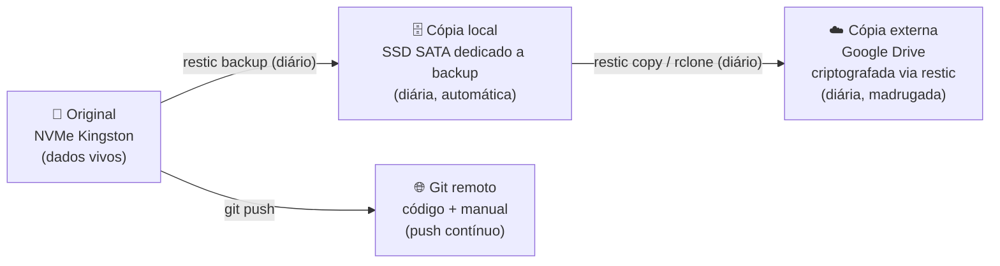

# 14. Backup e Recuperação de Desastre

Este capítulo responde a uma única pergunta, feita da forma mais dura possível:

!!! danger "O cenário de projeto"
    **A estação foi perdida por completo** — roubo, incêndio, surto elétrico, defeito irrecuperável. Nada do hardware sobrou. **Onde está tudo, e em quanto tempo a Protustech volta a trabalhar?**

Decisões de projeto (21/07/2026): **RPO de 1 dia** (perda máxima aceitável: um dia de dados não versionados; código em Git tem perda de minutos) · destino externo: **Google Drive** (conta existente), com criptografia do lado da estação.

## 14.1 Classes de dados — o que existe e para onde vai

Nem tudo merece o mesmo tratamento. O princípio P6 (infraestrutura como código) divide o mundo em **dados insubstituíveis** (backup obrigatório) e **coisas reconstruíveis** (documentação + download):

| Classe | Exemplos | Estratégia | Perda máxima |
|---|---|---|---|
| **Código e configuração** | Projetos (Moventus, Modulare, Corte), docker-composes, scripts, dotfiles, **este manual** | **Git remoto** (repositório privado) — push contínuo | Minutos (o que não foi commitado) |
| **Bancos de desenvolvimento** | PostgreSQL local | `pg_dump` diário → disco de backup local → Drive | 24 h |
| **Banco de produção (Moventus)** | Supabase | Backups do próprio Supabase **+ export semanal próprio** para o Drive — nunca depender só do fornecedor | 24 h (Supabase) / 7 dias (cópia própria) |
| **Dados de trabalho** | Documentos, fixtures do PASES-Bench, assets, notas | restic diário → disco local + Drive | 24 h |
| **Segredos** | Chaves SSH, tokens de API, **senha do restic** | Gerenciador de senhas + cópia física fora da máquina (ver 14.4) | Zero — nunca só na estação |
| **Modelos de IA** | Devstral, Qwen3-VL etc. (~dezenas de GB) | **Sem backup** — apenas um manifesto (`ollama list` exportado); tudo é re-baixável | N/A |
| **Sistema operacional** | Ubuntu, pacotes, drivers | **Sem imagem** — reconstruível pelos Capítulos 4–5 + scripts versionados; Timeshift é só conveniência local | N/A |

## 14.2 Arquitetura 3-2-1

Três cópias, duas mídias, uma fora do prédio:

O código tem, na prática, **quatro** cópias (NVMe, SATA, Drive e Git remoto). A perda total do equipamento deixa intactas as duas pernas externas: **Git remoto + Google Drive**.

## 14.3 Ferramentas Proposto — ADR-006

**restic** como motor de backup (criptografia forte do lado da estação, deduplicação, incremental, verificação de integridade), usando **rclone** como backend para o Google Drive. O Google nunca vê conteúdo — só blobs criptografados.

!!! warning "Limitação conhecida do Google Drive — e o plano B nomeado"
    O Drive não é um serviço de backup dedicado: a API sofre *throttling* e a velocidade varia. Para o volume crítico da estação (~100–200 GB, incremental diário pequeno) tende a bastar. **Gatilho de troca registrado no ADR-006:** se a janela de backup noturna passar a estourar ou falhar com frequência, o destino migra para Backblaze B2 (~US$ 1/mês para este volume) — a mudança é uma linha de configuração no restic/rclone, sem alterar nada mais.

## 14.4 Segredos — o elo que ninguém pode esquecer

A senha do repositório restic criptografa **todo** o backup externo. Se ela existir apenas dentro da estação, o backup morre junto com a máquina.

Regra: a senha do restic (e as credenciais essenciais: Git, Google, Supabase, Tailscale) vivem em **três lugares**: no gerenciador de senhas, numa cópia física (papel ou pendrive) guardada fora do prédio, e nunca somente na estação.

## 14.5 Plano de Reconstrução — o runbook do desastre

Com hardware novo em mãos (ordem testável, ver 14.6):

1. Montar a máquina e configurar a BIOS pelo **[Capítulo 4](04-bios.md)** (perfil `PASES-base` se o pendrive sobreviveu; checklist manual se não).
2. Instalar Ubuntu LTS pelo **[Capítulo 5](05-ubuntu.md)**.
3. Recuperar segredos do gerenciador de senhas / cópia física (14.4).
4. Clonar o repositório de infraestrutura: este manual, scripts, docker-composes.
5. `restic restore` da cópia do Google Drive → dados de trabalho e dumps de banco.
6. Subir a infraestrutura pelo **[Capítulo 6](06-infraestrutura.md)** (Docker, PostgreSQL, Redis) e restaurar os dumps.
7. Reconectar Supabase (produção nunca parou — está na nuvem).
8. Re-baixar modelos de IA pelo manifesto (**[Capítulo 8](08-inteligencia-artificial.md)**).
9. Restaurar chaves SSH/Tailscale e reconectar acessos.
10. Rodar o PASES-Bench como teste de sanidade final.

**RTO estimado: 1 dia útil** após o hardware disponível — dominado por download de modelos e restauração do Drive.

## 14.6 Teste de restauração — backup não testado não é backup

- **Trimestral**: restaurar um dump de banco + uma amostra de arquivos do Drive em um diretório limpo, e conferir integridade (`restic check` mensal, automatizado).
- **Anual**: "simulado de incêndio" — executar o runbook 14.5 numa VM limpa, medindo o tempo real de cada passo. O resultado (data + duração + problemas encontrados) é registrado neste capítulo.

## 14.7 Checklist de implementação Planejado

Depende da infraestrutura ([Cap. 6](06-infraestrutura.md)) e da instalação dos 2 SSDs SATA ([Cap. 3](03-hardware.md)):

- [x] Chave SSH da estação criada e cadastrada no GitHub (usuário `crystyano`) ✓
- [x] `pases-infra` (infraestrutura) versionado e enviado ao GitHub em 22/07/2026 ✓
- [ ] `pases-manual` — enviar o fonte do manual (repo já criado, vazio)
- [ ] Instalar o SSD SATA de backup, formatar (ext4, rótulo `backup`), montar em `/backup`
- [ ] Instalar restic + rclone; configurar remote do Google Drive; criar repositório restic criptografado
- [ ] Guardar a senha do restic nos três lugares da regra 14.4
- [ ] Script diário (systemd timer, madrugada): `pg_dump` de todos os bancos → restic → SATA → Drive
- [ ] Export semanal próprio do banco Supabase (Moventus) para o Drive
- [ ] Manifesto de modelos (`ollama list`) incluído no backup diário
- [ ] `restic check` mensal automatizado + alerta em falha ([Cap. 12](12-monitoramento.md))
- [ ] Primeiro teste de restauração trimestral executado e registrado aqui
- [ ] Timeshift local configurado (conveniência de rollback — não é o backup)
