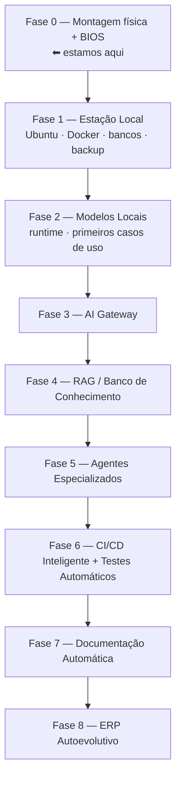

# 15. Roadmap

A evolução da plataforma acontece em fases. Cada fase só começa quando a anterior está **operacional e documentada** — a tentação de pular etapas é o maior risco do projeto.

| Fase | Entregável que a encerra | Status |
|---|---|---|
| 0 — Montagem + BIOS | Máquina estável, Capítulos 3 e 4 completos | Concluída ✓ 21/07/2026 |
| 1 — Estação Local | Infra base ✓ + **backup testado** (pendente), Capítulos 5, 6 e 14 | Em andamento — falta só o backup |
| 2 — Modelos Locais | Modelo local em uso diário real, Capítulo 8 (parcial) | Em andamento — Onda 1 no ar e aprovada em velocidade |
| 3 — AI Gateway | Projetos consumindo IA só via gateway | Proposto |
| 4 — RAG | Conhecimento da Protustech indexado e consultável | Proposto |
| 5 — Agentes | Fluxo de funcionalidade executado por agentes ponta a ponta | Proposto |
| 6 — CI/CD Inteligente | Build/teste/deploy sem intervenção manual | Proposto |
| 7 — Doc. Automática | Documentação gerada e atualizada por pipeline | Proposto |
| 8 — ERP Autoevolutivo | A definir quando a Fase 5 amadurecer | Proposto |

!!! tip "Regra de sequenciamento"
    Backup (Fase 1) vem antes de qualquer IA. Uma estação que perde dados não é acelerada por nada.
